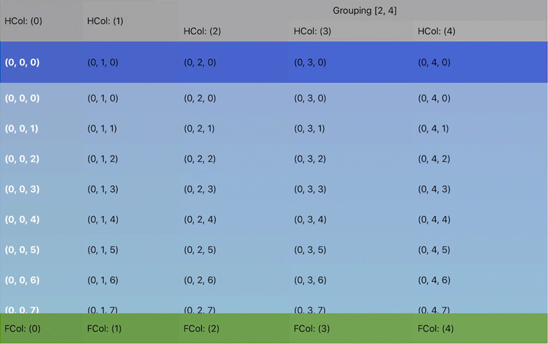

<p align="center">
    
</p>
<p>
    &nbsp;
</p>
<p align="center">
    <a href="https://github.com/nlampi/SwiftGridView/actions/workflows/ci.yml">
        
    </a>
    <a href="https://github.com/nlampi/SwiftGridView/releases">
        
    </a>
    <a href="https://swiftpackageindex.com/nlampi/SwiftGridView">
        
    </a>
    <a href="https://swiftpackageindex.com/nlampi/SwiftGridView">
        
    </a>
    <a href="./LICENSE">
        
    </a>
</p>

----------------

Swift based data grid component based on `UICollectionView`. `SwiftGridView` allows for quick and easy data grids that are fully customizable with powerful built in functionality.

## Features

Swift Grid View supports many of the expected features for a data grid in an easy to use package. 

#### DataGrid Cell Types
- Headers and Footers
- Section Headers and Footers
- Row Cells


#### Cell Selection
- Full Row or Single Cell Selection
- Multi selection
- Header or Footer Selection




#### Additional Functionality
- Sticky section headers
- Frozen Columns and Rows
- Grouped Headers
- SwiftUI support via the `SwiftGrid` view
- Swift 6 strict-concurrency ready: pure-Swift, `@MainActor`-isolated API
- Pinch to expand size (experimental)


## Requirements

- Xcode 16.0+
- iOS 15.0+

## Installation

SwiftGridView is distributed exclusively through the Swift Package Manager. (CocoaPods support ended with 0.7.8.)

1. In Xcode navigate to **File** → **Add Package Dependencies...**
2. Paste the repo URL (`https://github.com/nlampi/SwiftGridView.git`)
3. For the **Dependency Rule** choose **Up to Next Major Version** starting at `1.0.0`
4. Click **Add Package**

Or add it directly to your `Package.swift`:

```swift
dependencies: [
    .package(url: "https://github.com/nlampi/SwiftGridView.git", from: "1.0.0")
]
```

## Migrating from 0.7.x

Version 1.0 is a breaking release:

- **CocoaPods is no longer supported.** Remove `pod 'SwiftGridView'` from your Podfile and add the package via SPM instead.
- **The protocols are pure Swift.** Remove `@objc` from your conformances. Formerly-`optional` methods now have default implementations — delete any you implemented only to satisfy the compiler. View-providing methods (`gridHeaderViewForColumn`, `sectionHeaderCellAtIndexPath`, ...) crash with a clear message if you enable a feature without implementing them, matching the old behavior.
- **The minimum deployment target is iOS 15** and the API is `@MainActor`-isolated. Objective-C consumers are not supported.

See the [1.0.0 changelog entry](./CHANGELOG.md) for the full list.

## Usage

In UIKit, `SwiftGridView` works much like a `UICollectionView` or `UITableView`: provide a datasource and delegate.

```swift
import SwiftGridView

let gridView = SwiftGridView(frame: view.bounds)
gridView.dataSource = self  // SwiftGridViewDataSource
gridView.delegate = self    // SwiftGridViewDelegate
gridView.register(MyCell.self, forCellWithReuseIdentifier: MyCell.reuseIdentifier())
view.addSubview(gridView)
```

In SwiftUI, use the `SwiftGrid` view with the same datasource/delegate objects:

```swift
import SwiftGridView

SwiftGrid(dataSource: model, delegate: model) { gridView in
    gridView.register(MyCell.self, forCellWithReuseIdentifier: MyCell.reuseIdentifier())
}
```

For complete examples see the [example projects](./Examples).

## Communication

- Found a bug or have a feature request? [Open an issue](https://github.com/nlampi/SwiftGridView/issues).

## Documentation

Full documentation can be [found here](https://nlampi.github.io/SwiftGridView/documentation/swiftgridview/). Documentation is generated with [DocC](https://www.swift.org/documentation/docc/) and deployed by CI.

## License

Copyright 2016 - 2026 Nathan Lampi

SwiftGridView is released under the [MIT license](./LICENSE).
